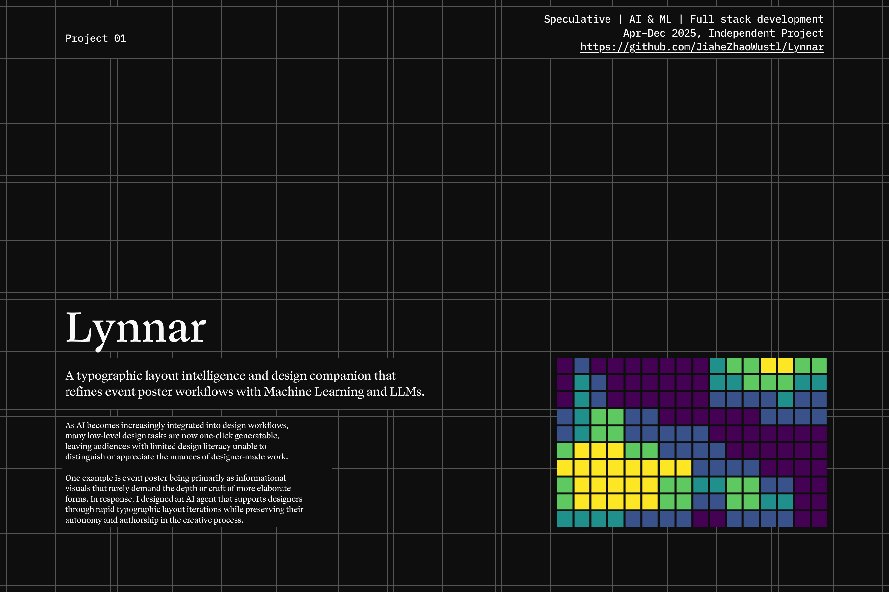
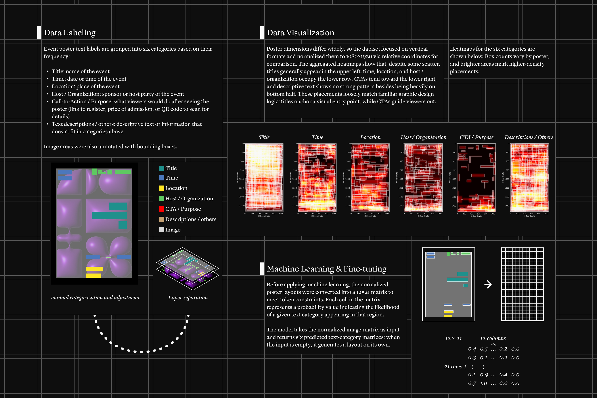
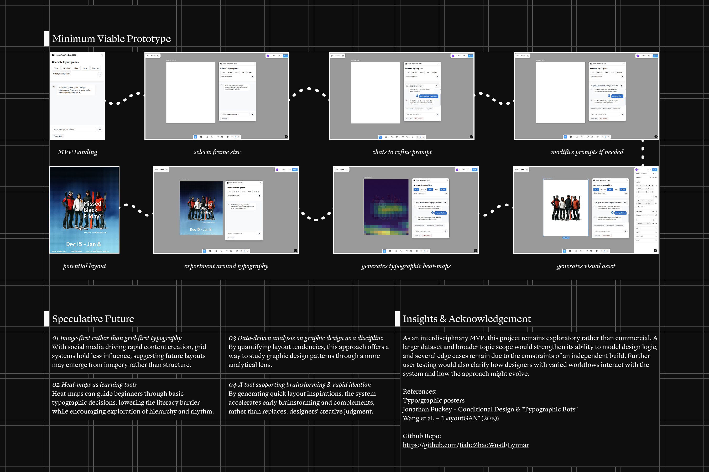

# Lynnar

This repo contains experiments and prototypes for Lynnar, an **LLM-assisted event poster design agent** (data tooling + a Figma plugin prototype).

<p align="center">
  
</p>

<p align="center">
  <b>A typographic layout intelligence and design companion</b><br/>
  refining event poster workflows with Machine Learning and LLMs.
</p>

## What’s in this repo

- **`heatmap-plugin-test/`**: Figma plugin prototype (UI + controller)
- **`plugin-backend/`**: Flask API used by the plugin for heatmap prediction + chat
- **`Label_Studio/`**: Scripts for building/visualizing heatmap datasets from Label Studio annotations
- **`DiscordBackend/`**: Scripts for cleaning / analyzing Midjourney Discord exports
- **`Training_Data/`**: Training dataset files and notes

## Slide deck highlights







## Quick start (plugin demo)

### 1) Start the backend

See `plugin-backend/README.md`.

### 2) Build the plugin

```bash
cd heatmap-plugin-test
npm install
npm run build
```

### 3) Load in Figma (development)

Use Figma’s dev plugin flow and point it to `heatmap-plugin-test/`.

## Repo notes

- Large datasets/exports are ignored via `.gitignore` to keep the repo lightweight.
- If you change `heatmap-plugin-test/code.ts`, re-run `npm run build` to regenerate `code.js` (Figma loads `code.js`).
- Copy `env.example` to `.env` to configure API keys.

## Thanks

To Ms. Lingyi (Lynn) Zhang 张凌逸, for her unwavering emotional support throughout the development of this project. Her patience and belief in my work carried me through countless late nights and moments of uncertainty. She is, without question, the best partner I could ever ask for.